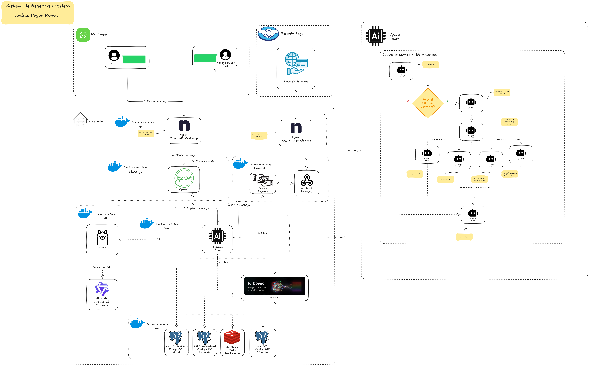

# Sistema de Hotel - Automatizacion

---

**Descripcion**
* Sistema de automatizacion de procesos inteligentes para hoteles
* Epecializado en proceso de Reservas de habitaciones
---

---

**Diagrama**

---

---

**Caracteristicas**
* Agenda
* Comprueba
* Confirma

---

---

**Integraciones**
* AI agents
* OpenWa
* Pasarela de pagos

---

---

**Servicios internos**
* Docker
* Ollama
* Ai model Qwen2.5-7B-Instruct
* Whatsapp Webhook
* PostgreSQL
* Redis

---

---

**Servicios externos**
* MercadoPago
* Whatsapp
---

---

**Servicios puente(internos que exponen al publico)**
* Ngrok
---

---

**Lenguaje de programacion**
* Python
---

---

**Repositorios**

| Herramienta | Docker | Link |
|-----------|-----------|-----------|
| Ollama    | ollama/ollama    | -    |
| Qwen2.5-7B-Instruct    | -    |  https://huggingface.co/Qwen/Qwen2.5-7B-Instruct    |
| Whatsapp API    | ghcr.io/rmyndharis/openwa:latest    | https://github.com/rmyndharis/OpenWA |
| PostgreSQL    | postgres:16-alpine    | -    |
| PostgreSQL/PGVector    | pgvector/pgvector:16-pgvector    | -    |
| Turbovec    | -   | https://github.com/RyanCodrai/turbovec |
| Ngrok    | ngrok/ngrok:3    | -    |
| Redis    | redis:7.2-alpine    | -    |

---
